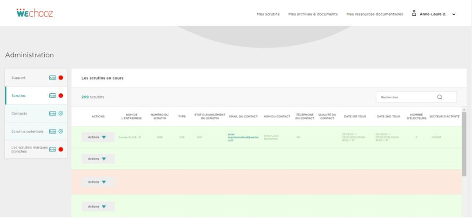

# WeChooz - Administration

## Informations générales

L'onglet Administration est disponible pour les collaborateurs de l'entreprise WeChooz. C'est une interface qui permet d’afficher dans un onglet « Scrutins » tous les scrutins en cours sous forme de tableau en y affichant les informations de premières nécessités.

Ce dépôt contient les différents scripts, queries, modèles GraphQL.. nécessaires au bon fonctionnement du projet.

## Prérequis

`.NET Framework 4.6 ou ultérieur` 🔨
`React 16.8.6` 🚀

## Installation

Dans le dossier où installer le projet:

`$ cp Docker.env.dist Docker.env`
`$ nano Docker.env`

- APP_NAME: Va servir à prefixer les conteneurs Docker
- APP_HOST: Le hostname depuis lequel le site sera accessible
- APP_PORT: Le port depuis lequel le hostname sera accessible
- APP_WEB_DIR: Le dossier web de l'application (ici : /public/)
- APP_INDEX : l'index de l'app (ici index.php)
- APP_ENV : l'environnement, utilisé par Lumen, gulp, Docker et webpack. dev, preprod ou prod
- APP_DEBUG : true si Lumen doit tourner en mode debug, false sinon (ex : en prod)
- ASSETS_DIR : le répertoire où les fichiers JS et CSS sont générés (ici public/assets/)

On renseigne le site dans ses hosts locaux :

`$ (source Docker.env && echo -e "127.0.0.1\t${APP_HOST}") | sudo tee -a /etc/hosts`

On peut maintenant construire le Docker container (c'est lent la première fois) :

`$ make start`

## Commandes de base

`make start: Lance les conteneurs du projet.`

`make stop: Stope les conteneurs du projet.`

`make sh: Connecte à la machine du projet.`

`make perm: Corrige les permissions des répertoire dans lesquels le serveur écrit (storage/*).`

`make install : installe les dépendances PHP et JavaScript`

`make watch : lance le watcher (webpack + gulp)`

`make assets : génère les fichiers CSS et JS`

## Frontend

Les fichiers JS source doivent être mis dans `front/assets/js`.
Les fichiers SASS source doivent être mis dans `front/assets/sass`.

Avant de commencer à travailler, lancer le watcher avec `make watch`.

Lors de la mise en production, compiler les sources avec `make assets`.

## Screenshots

## Licence

Copyright (c) 2021-2022, We-Chooz.

Ce projet est sous licence ISC.

Permission to use, copy, modify, and/or distribute this software for any purpose with or without fee is hereby granted, provided that the above copyright notice and this permission notice appear in all copies.

THE SOFTWARE IS PROVIDED "AS IS" AND THE AUTHOR DISCLAIMS ALL WARRANTIES WITH REGARD TO THIS SOFTWARE INCLUDING ALL IMPLIED WARRANTIES OF MERCHANTABILITY AND FITNESS. IN NO EVENT SHALL THE AUTHOR BE LIABLE FOR ANY SPECIAL, DIRECT, INDIRECT, OR CONSEQUENTIAL DAMAGES OR ANY DAMAGES WHATSOEVER RESULTING FROM LOSS OF USE, DATA OR PROFITS, WHETHER IN AN ACTION OF CONTRACT, NEGLIGENCE OR OTHER TORTIOUS ACTION, ARISING OUT OF OR IN CONNECTION WITH THE USE OR PERFORMANCE OF THIS SOFTWARE.
